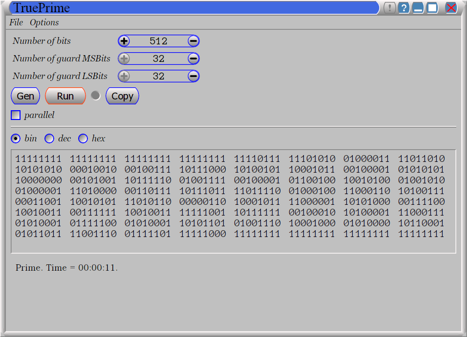
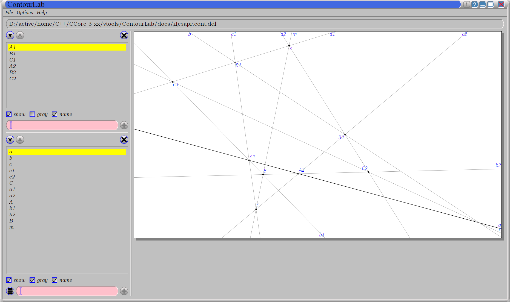
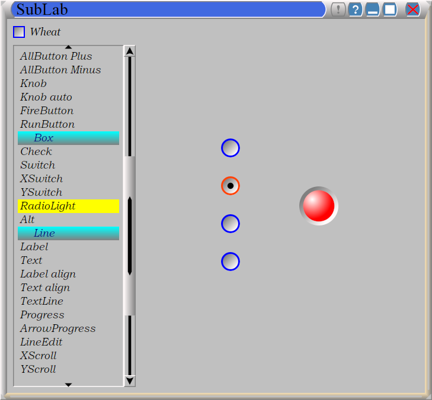
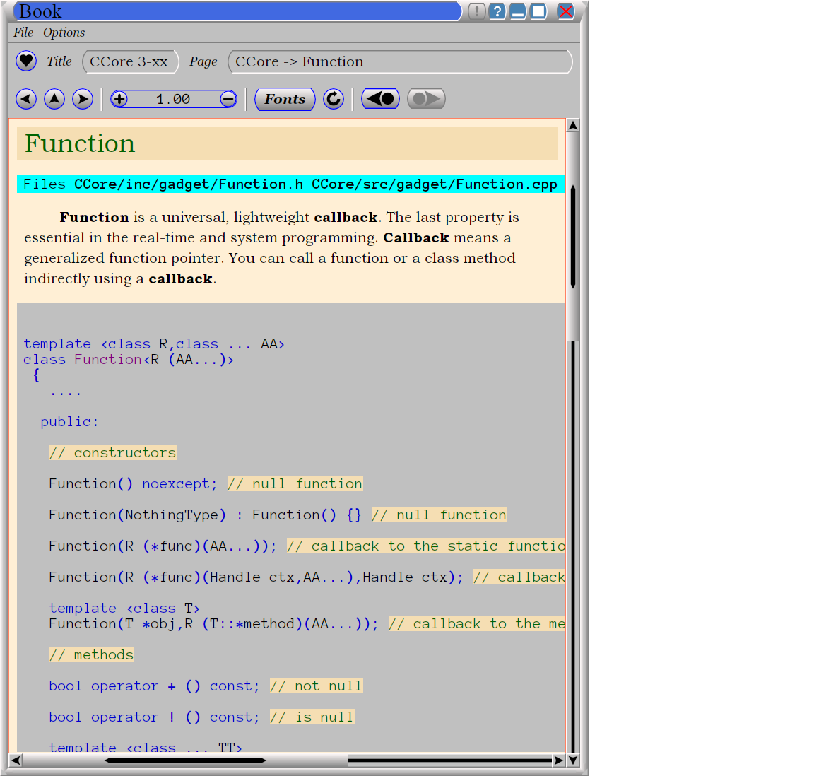

.. title:: CCore brief

.. ------------------------------------------------------------------------------------------------------------------

CCore brief
===========

Many years ago I had started this project ... :ref:`to_ab_ovo`

**CCore** uses an advanced memory manager ... :ref:`to_heap`

**CCore** provides `Printf()` print facility ... :ref:`to_printf`

**CCore** uses an advanced exception handling pattern ... :ref:`to_exception`

One of the most useful invention, implemented in **CCore**, is **DDL** ... :ref:`to_DDL`

**CCore** provides an advanced synchronization basis ... :ref:`to_sync`

**CCore** implements the **Packets** -- infrastructure for the mass asynchonous request processing ... :ref:`to_packets`

**CCore** contains number of new network protocols and components ... :ref:`to_net`

and much more ...  

**CCore** source contains many advanced C++ tricks, based on the latest C++ language features. 
No way I can describe all of them in this *brief notes*.
So put your hands on ...  

The latest development stream is `on github <https://github.com/SergeyStrukov/CCore-3-xx/releases>`_.

.. ------------------------------------------------------------------------------------------------------------------

.. _to_ab_ovo:

Ab ovo
------

Initially I had created a small real-time bare-metal core, mostly for experimental purpose.
It was a kind of back-up for small tasks, where using a full-scale commercial RTS was too much expensive.
But the core was well-made, and I decided continue development up to some extent.
Eventually, this project become a solid platform, well suited for wide range of tasks, both host and embedded.
I had a solid experience in software development (including embedded one) and I had a good vision, what do I want
from a proper development platform. So far none of existing gives me even a fraction of what I want.
So I am lovely developing **CCore** and use it for software development. 

The main goal of **CCore** was to bring the fully-featured **C++** to the embedded development.
Up to present time there ara many projects, written on pure **C**. 
This is really weird situation. 
**C** is a primitive language, not suited for large scale projects, the practical ceil of **C** is 10000 LOC. 
Everything above this size must not be developed on pure **C**.
In fact, **C** became a toxic language, polluting the software world.  
So **CCore** gives a better alternative. 
It is not only opens the door for **C++**, but provides well suited library support.
In times **CCore** was started the standard **C++** library was not develop well enough.
For example, you could not put a non-copyrable object in the `vector`.
Many important things, large or small, required for the professional development, are still missing in the standard library up to present.  

One of the shameful lack in the modern **C++** standard library is the absence of well developed printing tools.
There are two options: the old-school **C** **stdio** and the **C++** **iostream**. 
Both are crap.  
The first is not type-safe and type-driven, neither type-extendable.
In **iostream** format options are included in the stream object.
This is a principal architectural mistake. 
The printing streams itself are hard-to-use. 
Compare::  

    Printf(Con,"#8.16i;\n",12345);
    
    Printf(Con,"#;\n",67890);

and::

    cout << hex << setw(8) << setiosflags(ios::internal) << setfill('0') << 12345 << endl 
         << dec << setiosflags(ios::right) << setfill(' ') ; // reset format flags
    
    cout << 67890 << endl ;

So **CCore** includes its own printing subsystem, much more practical.

Both **C** and **C++** provides a support for the dynamic memory allocation.
Unfortunately, this support lacks some important features.
What do I need from the heap?

1. First, speed and real-time properties for embedded systems.
2. Internal integrity check.
3. Memory block extension and shrinking.
4. Statistic counting.

So I included in **CCore** such a heap feature.  

Usually embedded systems havily use networks for various purposes.
That's why a good support for network applications is required.
**CCore** includes implementation of a proper infrastructre for that 
as well as an implementation of a set of new network protocols.      

The latest big extension of **CCore** is a GUI development support. 
This part is almost finalized, but not yet documented.

.. ------------------------------------------------------------------------------------------------------------------

.. _to_heap:

Heap
----

**CCore** heap has the following features:

1. Best fit.

      Heap selects a smallest available block of memory to satisfy an allocation request.

2. Fast, with real-time properties.

3. Integrity check.

      If you try to use an invalid pointer as a heap function argument, it will be higly likely detected and abort will be called.

4. Extended interface.

   Here is a list of heap functions::
   
       void * TryMemAlloc(ulen len) noexcept;
    
       void * MemAlloc(ulen len);
    
       ulen MemLen(const void *mem);       // mem may == 0
    
       bool MemExtend(void *mem,ulen len); // mem may == 0
    
       bool MemShrink(void *mem,ulen len); // mem may == 0
    
       void MemFree(void *mem);            // mem may == 0
    
       void MemLim(ulen limit);
       
   You can not only allocate and deallocate blocks of memory, but you can resize them in place (if possible).
   This is useful in the building of resizable arrays and other containers.
    
   You can also set a memory allocation limit. 
   This feature is useful for testing.
   
   Heap has also some statistic functions, this allow to watch over the memory usage.     

These features are highly valuable in any kind of software development.    

.. ------------------------------------------------------------------------------------------------------------------

.. _to_printf:

`Printf()`
----------

`Printf()` is similar to the **C** `printf()`.
It works as the following::

  int x = 12345 ;
    
  Printf(Con,"x = #;\n\n",x);

The first argument is a *printer* object. In this case it is the console.
The second is a format string. By tradition it is a null terminated string.
After the format string an arbitrary number of arguments of any *printable* types may follow.
They will be printed in places of format stems.
Each format stem is a sequence like `"#...;"`.
Between the starting `'#'` symbol and the ending `';'` symbol options my be specified::

  Printf(Con,"--- #10l; ---\n",12345);
  Printf(Con,"--- #10i; ---\n",12345);
  Printf(Con,"--- #10r; ---\n",12345);
  Printf(Con,"--- #+10.5l; ---\n",12345);
  Printf(Con,"--- #+10.hi; ---\n",12345);
  Printf(Con,"--- #10.hi; ---\n",-12345);

  Printf(Con,"--- #10.f2l; ---\n",12345);
  Printf(Con,"--- #10.f2i; ---\n",12345);
  Printf(Con,"--- #10.f2r; ---\n",12345);

  Printf(Con,"--- #10.f2l; ---\n",-12345);
  Printf(Con,"--- #10.f2i; ---\n",-12345);
  Printf(Con,"--- #10.f2r; ---\n",-12345);

  Printf(Con,"--- #10.f2l; ---\n",-12);
  Printf(Con,"--- #10.f2i; ---\n",-12);
  Printf(Con,"--- #10.f2r; ---\n",-12);

  Printf(Con,"--- #10.f4l; ---\n",12);
  Printf(Con,"--- #10.f4i; ---\n",12);
  Printf(Con,"--- #10.f4r; ---\n",12);

  Printf(Con,"--- #10.f2l; ---\n",0);
  Printf(Con,"--- #10.f2i; ---\n",0);
  Printf(Con,"--- #10.f2r; ---\n",0);
  
and the output is::  
  
    --- 12345      ---
    --- 0000012345 ---
    ---      12345 ---
    --- +343340    ---
    --- +00003039h ---
    --- -00003039h ---
    --- 123.45     ---
    --- 0000123.45 ---
    ---     123.45 ---
    --- -123.45    ---
    --- -000123.45 ---
    ---    -123.45 ---
    --- -0.12      ---
    --- -000000.12 ---
    ---      -0.12 ---
    --- 0.0012     ---
    --- 00000.0012 ---
    ---     0.0012 ---
    --- 0.00       ---
    --- 0000000.00 ---
    ---       0.00 ---  

`Printf()` ties together a printer object, a format string and printable objects.
You can easily develope these kind of objects to match your particular needs.

Printer class
*************

In general, to make a class a printer you have to define the following class elements::

  class PrintToSomething
   {
    public:
    
     using PrintOutType = PrintToSomething & ;

     PrintOutType printRef() { return *this; }
     
     void put(char ch);

     void put(char ch,ulen len);

     void put(const char *str,ulen len);

     void flush();
   };

In most cases, however, it's better to inherit from the following base class for printer types::

    class PrintBase : NoCopy
     {
       ....
       
       virtual PtrLen<char> do_provide(ulen hint_len)=0;
    
       virtual void do_flush(char *ptr,ulen len)=0;
    
      public:
    
       using PrintOutType = PrintBase & ;
    
       PrintOutType printRef() { return *this; }
    
       // constructors
    
       PrintBase();
    
       ~PrintBase();
    
       // methods

       ....    
     };

You have to implement two virtual functions in a derived class to output printed characters to whatever you want.

Printable types
***************

Making a type printable is simple like this::

    struct IntPoint
     {
      int x;
      int y;
      
      ....
      
      // print object
    
      void print(PrinterType &out) const
       {
        Printf(out,"(#;,#;)",x,y);
       } 
     };

OR, if you need a printing options, like this::

    struct PrintDumpOptType
     {
      ....
      
      void setDefault();
    
      PrintDumpOptType() { setDefault(); }
    
      PrintDumpOptType(const char *ptr,const char *lim);
    
      //
      // [width=0][.line_len=16]
      //
     };
     
    template <UIntType UInt>
    class PrintDump
     {
       PtrLen<const UInt> data;
    
      public:
    
       ....
    
       using PrintOptType = PrintDumpOptType ;
    
       void print(PrinterType &out,PrintOptType opt) const;
     };

.. ------------------------------------------------------------------------------------------------------------------

.. _to_exception:

Exceptions
----------

**CCore** uses the special pattern to throw and catch exceptions:

1. All exception are of type `CatchType`, which is an empty structure::

      try
        {
         ....
        }
      catch(CatchType)
        {
        }

2. To get exception notifications you have to define a special object::  

      try
        {
         ReportException report;
        
         ....
        }
      catch(CatchType)
        {
        }

3. To react on `no-exceptions` you have to call the special method `guard()`::

      try
        {
         ReportException report;
        
         {
          ....
         } 
         
         report.guard();
        }
      catch(CatchType)
        {
        }

4. To throw an exception use the function `Printf()`::

      Printf(Exception,"Shit happened"); 
      
        // exception will be thrown by this call 
      
   OR::    
   
      Printf(NoException,"Shit happened, but we continue ..."); 
      
        // no exception will be thrown by this call
      
5. Event if you don't throw an exception, `report` object gets the exception text ans sets an internal flag.
   So later, when you call `report.guard()` an exception will be eventually thown.       

Using this pattern you can safely handle exceptional situations in class destructors::

    PrintFile::~PrintFile()
     {
      if( isOpened() )
        {
         FileMultiError errout;
    
         soft_close(errout);
    
         if( +errout )
           {
            Printf(NoException,"CCore::PrintFile::~PrintFile() : #;",errout);
           }
        }
     }

No one glitch will be forgotten!

.. ------------------------------------------------------------------------------------------------------------------

.. _to_DDL:

DDL
---

**DDL** expands as "Data Definition Language". 
This is a textual language for representation of data.
**DDL** files looks like::

    type Bool = uint8 ;
    
    Bool True = 1 ;
    Bool False = 0 ;
    
    struct FavElement
     {
      text title;
      text path;
      Bool section = False ;
      Bool open = True ;
     };
    
    struct FavData
     {
      FavElement[] list;
      
      ulen off = 0 ;
      ulen cur = 0 ;  
     };

and like this::
 
    //include <FavData.ddl>
    
    FavData Data =
     {
    
      {
       { "CCore" , "" , True , True },
       { "CCore 3-xx" , "D:/active/home/C++/CCore-3-xx/book/CCore.book.vol" , False , True },
       { "Sample" , "" , True , False },
       { "CCore 3-xx" , "D:/active/home/C++/CCore-3-xx/book/sample/CCore.book.ddl" , False , False }
      },
    
      0,
      1
     };

You can find the complete description `here <https://github.com/SergeyStrukov/CCore-3-xx/blob/master/doc/DDL.pdf>`_.
**DDL** is

1. **C**-style,
2. typed,
3. commutative,
4. flexible,
5. polymorphe,
6. simple.

It can be conveniently used for representation of any kind of data with any level of internal connectivity.
For example, this types are used to reprersent context-free grammars and LR1 state machines::

    type AtomIndex = uint32 ;
    type SyntIndex = uint32 ;
    type KindIndex = uint32 ;
    type ElementIndex = uint32 ;
    type RuleIndex = uint32 ;
    type StateIndex = uint32 ;
    type FinalIndex = uint32 ;
    
    struct Lang
     {
      Atom[] atoms;
      Synt[] synts;
      Synt * [] lang;
      Element[] elements;
      Rule[] rules;
      TopRule[] top_rules;
      State[] states;
      Final[] finals;
     };
    
    struct Atom
     {
      AtomIndex index;
      text name;
      
      Element *element;
     };
    
    struct Synt
     {
      SyntIndex index;
      text name;
      
      Kind[] kinds;
      Rule * [] rules;
     };
    
    struct Kind
     {
      KindIndex kindex; // index among all kinds
      KindIndex index; // index in synt array
      text name;
    
      Synt *synt;
      
      Element *element;
      
      TopRule * [] rules;
     };
    
    struct Element
     {
      ElementIndex index;
      
      {Atom,Kind} * elem;
     };
    
    struct Rule
     {
      RuleIndex index;
      text name;
    
      Kind *result;
    
      type Arg = {Atom,Synt} * ;
    
      Arg[] args;
     };
     
    struct TopRule
     {
      RuleIndex index;
      text name;
      
      Rule *bottom;
    
      Kind *result;
    
      type Arg = {Atom,Kind} * ;
    
      Arg[] args;
     }; 
    
    struct State
     {
      StateIndex index;
      Final *final;
    
      struct Transition
       {
        Element *element;
        State *state;
       };
    
      Transition[] transitions;
     };
    
    struct Final
     {
      FinalIndex index;
    
      struct Action
       {
        Atom *atom; // null for (End)
        Rule *rule; // null for <- ( STOP if atom is (END) )
       };
    
      Action[] actions;
     };

And more samples::

    int a = 10 ;
    
    int * pa = &a ;
    
    text [a] B = { "b1" , "b2" } ;
    
    text [] C = { "c1" , "c2" } ;
    
    struct S
     {
      text name = "unnamed" ;
      int id = 0 ;
     };
    
    S record = { "" , 10 } ;

,::
    
    int a = 10 ;

    int * pa = &a ;
    
    int b = *pa ; // 10
    
    int[10] c = {0,1,2,3,4,5,6,7,8,9} ;
    
    int * pc = c+5 ;
    
    int d = *pc ; // 5
    int e = pc[2] ; // 7
    
    int l = pc - c ; // 5

,::

    type Ptr = {int,uint} * ; 
    
    int a = 1 ;
    
    uint b = 2 ;
    
    Ptr ptr_a = &a ; 
    
    Ptr ptr_b = &b ;

**DDL** is not intended for the manual data edition. 
Normally **DDL** files are generated by software and used by another software.
It is a *Soft-to-Soft* language. 
You can think about it as a "universal data assembler".
I am lovely using **DDL** for many years for different purposes:

1. configuration files,
2. complex data files, like shown above,
3. Book files, this is a latest GUI component, developed to represent formatted text:

So I advise everybody learn and use it in your projects.
You will be loving it too!
Printing **DDL** files is easy, you can do it using `Printf()`.
To load data from **DDL** files, however, you need a library.
**CCore** contains components and tools to do it, but you may develope your own, 
using **CCore** implementtaion as a reference design.    

.. ------------------------------------------------------------------------------------------------------------------

.. _to_sync:

Synchronization
---------------

To develope multi-thread applications a good set of synchronization primitives is required.
**CCore** defines the following such set:

1. Mutex,
2. Sem(aphore),
3. Event,
4. MultiSem,
5. MultiEvent,
6. AntiSem,
7. ResSem.

**Mutex** is a usual resource lock synchronization class::

    class Mutex : NoCopy
     {
       ....
       
      public:
    
       explicit Mutex(unsigned spin_count=MutexSpinCount());
    
       explicit Mutex(TextLabel name,unsigned spin_count=MutexSpinCount());
    
       ~Mutex();
    
       void lock();
    
       void unlock();
    
       unsigned getSemCount();
    
       using Lock = LockObject<Mutex> ;
     };

**Sem** is a usual semaphore::

    class Sem : public Funchor_nocopy
     {
       ....
    
      public:
    
       // constructors
    
       explicit Sem(ulen count=0);
    
       explicit Sem(TextLabel name,ulen count=0);
    
       ~Sem();
    
       // give
    
       void give();
    
       void give_many(ulen dcount);
    
       // take
    
       bool try_take();
    
       void take();
    
       bool take(MSec timeout);
    
       bool take(TimeScope time_scope);
    
       // functions
    
       Function<void (void)> function_give() { return FunctionOf(this,&Sem::give); }
     };

**CCore** synchronization objects have two main kind of methods: giving and taking.
Taking methods may block execution of the calling thread. 
So they usually have several variants: without timeout, 
with a timeout in *milliseconds*,
with a timeout as a *TimeScope*,
and a try variant with the "immediate" timeout.
If a taking method with a timeout is failed, it returns **false**.
Giving methods does not block, inversely, they may release a blocked on this synchronization object thread.
And such methods comes with a callback. 
So you may call these methods indirectly using a light-weight callback **Function<>**.

**TimeScope** is a special method of the specifying a timeout. 
It starts at the moment, the object of this type is created, and lasts for the given period of time::

    class TimeScope
     {
       MSecTimer timer;
    
       MSec timeout;
    
      public:
    
       explicit TimeScope(MSec timeout_=Null) noexcept : timeout(timeout_) {}
    
       void start(MSec timeout_)
        {
         timer.reset();
    
         timeout=timeout_;
        }
    
       bool nextScope();
    
       bool nextScope_skip();
    
       MSec get() const
        {
         auto t=timer.get();
    
         if( t >= +timeout ) return Null;
    
         return MSec(unsigned( +timeout - t ));
        }
     };

It is very useful if you want to timed a combination of blocking calls::

    void func(TimeScope time_scope)
     {
      op1(time_scope);
      op2(time_scope);
      op3(time_scope);
     }
    
    void func(MSec timeout)
     {
      TimeScope time_scope(timeout);
    
      op1(time_scope);
      op2(time_scope);
      op3(time_scope);
     }

**Event** is a binary semaphore::

    class Event : public Funchor_nocopy
     {
       ....
       
      public:
    
       // constructors
    
       explicit Event(bool flag=false);
    
       explicit Event(TextLabel name,bool flag=false);
    
       explicit Event(const char *name) : Event(TextLabel(name)) {}
    
       ~Event();
    
       // trigger
    
       bool trigger();
    
       // wait
    
       bool try_wait();
    
       void wait();
    
       bool wait(MSec timeout);
    
       bool wait(TimeScope time_scope);
    
       // functions
    
       void trigger_void() { trigger(); }
    
       Function<void (void)> function_trigger() { return FunctionOf(this,&Event::trigger_void); }
     };

**MultiSem** is a set of semaphors. 
This class is vital, if you need to handle events from multiple sources.
For example, if you have to handle device interrupts and user requests in a device driver.
Or to manage multiple networks connections. And so on:: 

    template <ulen Len>
    class MultiSem : public MultiSemBase
     {
       ....
    
      public:
    
       MultiSem();
    
       explicit MultiSem(TextLabel name);
    
       ~MultiSem();
     };
   
    class MultiSemBase : public Funchor_nocopy
     {
       ....
       
      public:
    
       // give
    
       void give(ulen index); // [1,Len]
    
       // take
    
       ulen try_take(); // [0,Len]
    
       ulen take(); // [1,Len]
    
       ulen take(MSec timeout); // [0,Len]
    
       ulen take(TimeScope time_scope); // [0,Len]
    
       // give<Index>
    
       template <ulen Index> // [1,Len]
       void give_index() { give(Index); }
    
       // functions
    
       template <ulen Index>
       Function<void (void)> function_give() { return FunctionOf(this,&MultiSemBase::give_index<Index>); }
     };

When you use **MultiSem**, you give some index (of event), `take()` returns an available index in the round-robing manner.

**MultiEvent** is a set of events. It is similar to the **MultiSem**, but designed based on **Events**, not **Sems**::

    template <ulen Len>
    class MultiEvent : public MultiEventBase
     {
       ....
    
      public:
    
       MultiEvent();
    
       explicit MultiEvent(TextLabel name);
    
       ~MultiEvent();
     };
     
    class MultiEventBase : public Funchor_nocopy
     {
       ....
       
      public:
    
       // trigger
    
       bool trigger(ulen index); // [1,Len]
    
       // wait
    
       ulen try_wait(); // [0,Len]
    
       ulen wait(); // [1,Len]
    
       ulen wait(MSec timeout); // [0,Len]
    
       ulen wait(TimeScope time_scope); // [0,Len]
    
       // trigger<Index>
    
       template <ulen Index> // [1,Len]
       void trigger_index() { trigger(Index); }
    
       // functions
    
       template <ulen Index>
       Function<void (void)> function_trigger() { return FunctionOf(this,&MultiEventBase::trigger_index<Index>); }
     };

**AntiSem** is a "gateway". A thread can wait on this synchronization object until the internal counter of the 
object becomes below the defined level (0 by default). 
This synchronization object is useful for waiting of completion of multiple activities (like completion of multiple tasks)
or releasing of number of resources:: 
 
    class AntiSem : public Funchor_nocopy
     {
       ....
       
      public:
    
       // constructors
    
       explicit AntiSem(ulen level=0);
    
       explicit AntiSem(TextLabel name,ulen level=0);
    
       ~AntiSem();
    
       // add/sub
    
       void add(ulen dcount);
    
       void sub(ulen dcount);
    
       // inc/dec
    
       void inc() { add(1); }
    
       void dec() { sub(1); }
    
       // wait
    
       bool try_wait();
    
       void wait();
    
       bool wait(MSec timeout);
    
       bool wait(TimeScope time_scope);
    
       // functions
    
       Function<void (void)> function_inc() { return FunctionOf(this,&AntiSem::inc); }
    
       Function<void (void)> function_dec() { return FunctionOf(this,&AntiSem::dec); }
     };
 
**ResSem** is a hybrid of **ResSem** and **Sem**::

    class ResSem : public Funchor_nocopy
     {
       ....
       
      public:
    
       // constructors
    
       explicit ResSem(ulen max_count);
    
       ResSem(TextLabel name,ulen max_count);
    
       ~ResSem();
    
       // give
    
       void give();
    
       // take
    
       bool try_take();
    
       void take();
    
       bool take(MSec timeout);
    
       bool take(TimeScope time_scope);
    
       // wait
    
       bool try_wait();
    
       void wait();
    
       bool wait(MSec timeout);
    
       bool wait(TimeScope time_scope);
    
       // functions
    
       Function<void (void)> function_give() { return FunctionOf(this,&ResSem::give); }
     };

It has an internal counter, which remains in the range `[0,max_count]`, 
where **max_count** is a **ResSem** counter limit. 
Initially the counter equals **max_count**. 
Like a usual semaphore, **ResSem** has `take()` and `give()` operations, 
but it has the additional "gateway" operation `wait()`, which blocks the calling thread until the counter gets back to its maximum value. 

.. ------------------------------------------------------------------------------------------------------------------

.. _to_packets:

Packets
-------

When we design a system level services, we need to serve a massive tide of requests, 
coming independently from multiple tasks. 
Consider, for example, a network service stack.
Application level tasks issue requests to send network packets, each packet has a body
and destination address. 
Each of this requests must be processed, address must be resolved, body must be updated,
finally, packet comes to a network card driver, which sends it on the wire.
To develope such subsystems some basic infrustructure is required.
The whole subsystem is a set of processing entities, they send to each other *packets*,
each packet is some data structure with attached *completion routine*.
Once a packet is handled, it sends to a next processing unit, or completed.
**CCore** contains such infrustructure, **Packets**, and number of devices, which
provides various packet services.
For example, **AsyncUDPMultipointDevice** sends and receives **UDP** packets::

    class AsyncUDPMultipointDevice : public PacketMultipointDevice
     {
       ....
       
      public:
    
       // constructors
    
       static constexpr ulen DefaultMaxPackets = 500 ;
    
       explicit AsyncUDPMultipointDevice(UDPort udport,ulen max_packets=DefaultMaxPackets);
    
       virtual ~AsyncUDPMultipointDevice();
    
       // PacketMultipointDevice
    
       virtual StrLen toText(XPoint point,PtrLen<char> buf) const;
    
       virtual PacketFormat getOutboundFormat() const;
    
       virtual void outbound(XPoint point,Packet<uint8> packet);
    
       virtual ulen getMaxInboundLen() const;
    
       virtual void attach(InboundProc *proc);
    
       virtual void detach();
    
       ....    
     };

.. ------------------------------------------------------------------------------------------------------------------

.. _to_net:

Networking
----------

**CCore** implements a set of packet-processing classes for network applications.
To work with network an abstraction layer is used.
It is presented with two abstract classes: **PacketEndpointDevice** and **PacketMultipointDevice**::

    struct PacketEndpointDevice
     {
      // outbound
      
      virtual PacketFormat getOutboundFormat() const =0;
       
      virtual void outbound(Packet<uint8> packet)=0;
      
      // inbound
       
      virtual ulen getMaxInboundLen() const =0;
       
      struct InboundProc : InterfaceHost
       {
        virtual void inbound(Packet<uint8> packet,PtrLen<const uint8> data)=0;
         
        virtual void tick()=0;
       };
       
      virtual void attach(InboundProc *proc)=0;
       
      virtual void detach()=0;
     };

    struct PacketMultipointDevice
     {
      virtual StrLen toText(XPoint point,PtrLen<char> buf) const =0;
       
      // outbound 
     
      virtual PacketFormat getOutboundFormat() const =0;
       
      virtual void outbound(XPoint point,Packet<uint8> packet)=0;

      // inbound
       
      virtual ulen getMaxInboundLen() const =0;
       
      struct InboundProc : InterfaceHost
       {
        static const Unid TypeUnid;
    
        virtual void inbound(XPoint point,Packet<uint8> packet,PtrLen<const uint8> data)=0;
         
        virtual void tick()=0;
       };
       
      virtual void attach(InboundProc *proc)=0;
       
      virtual void detach()=0;
     };

First of them is used for point-to-point communications, second -- for point-to-multipoint.
The first case is typical for client applications, but the second -- for the server ones.
There are classes like **UDPEndpointDevice** to establish a communication using the **UDP** protocol.

**CCore** implements a set of new application-level network protocols like **PTP**.
**PTP** is the "Packet Transaction Protocol". 
This is a packet-based, reliable, transactional, parallel point-to-point protocol. 
It is best suited to implement an asynchronous call-type client-server interaction.   
**PTP** defines rules for two endpoints, one is the **Server**, another is the **Client**. 
These endpoints exchange raw data packets (byte packets). 
**Client** issues call requests, **Server** takes call data, processes it and returns some resulting data. 
From the **Client** perspective, it makes a function call. 
Function arguments is a byte range. 
**Server** "evaluates" the function and returns a result — another byte range. 
The meaning of data is out of scope **PTP** protocol, it is defined by an upper protocol level. 
Usually, **Server** may serve multiple **Clients**. 
From the protocol perspective all transactions are parallel and independent.
 
.. ------------------------------------------------------------------------------------------------------------------

